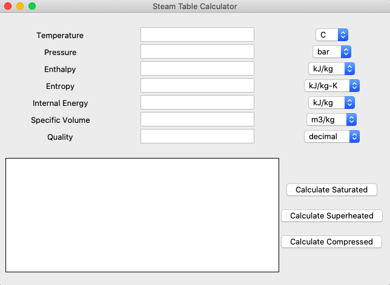
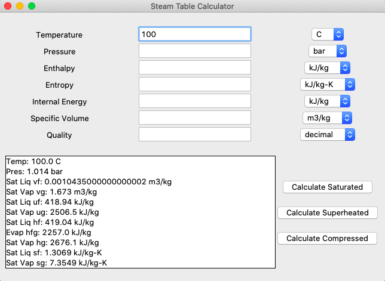
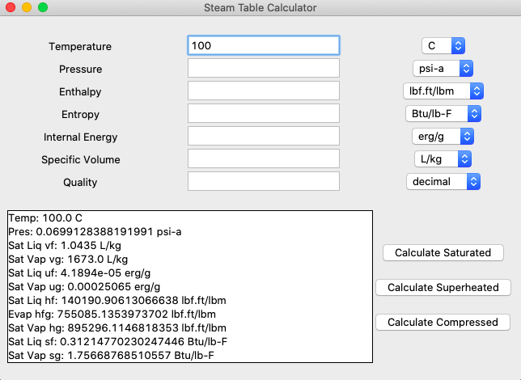
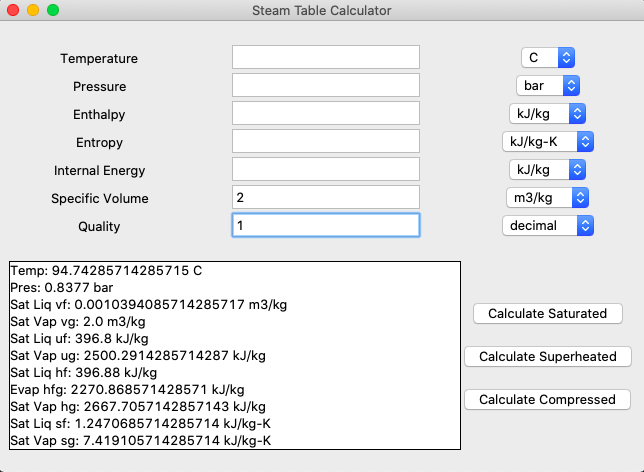
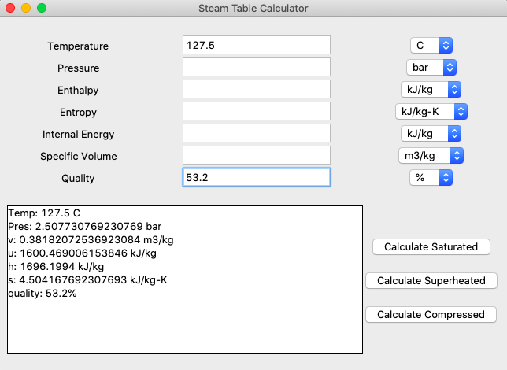
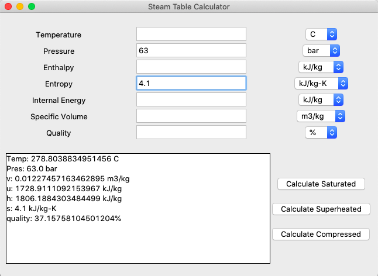
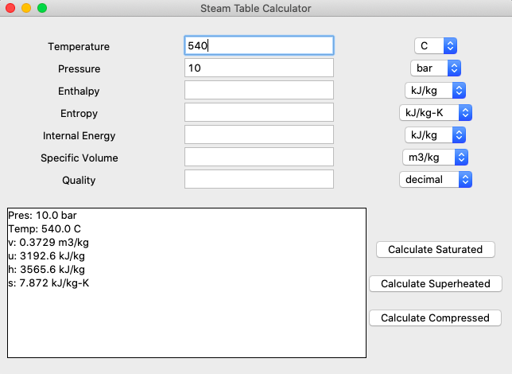
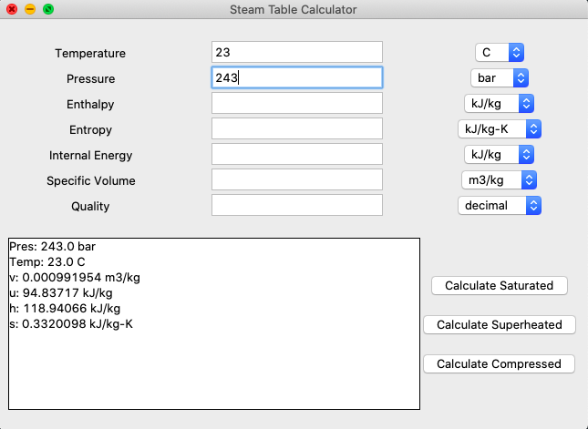
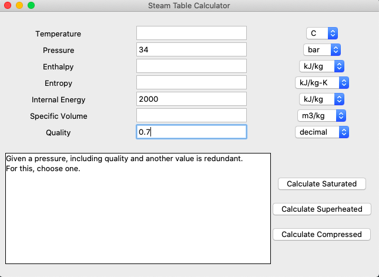
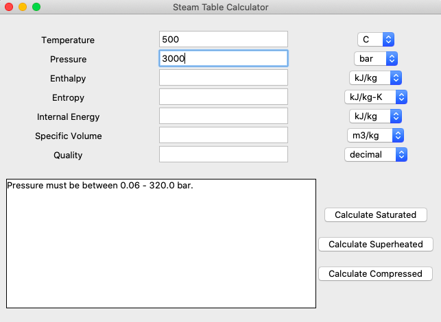

# Steam Table Calculator
###Calculates properties of water using compressed/saturated/superheated water tables.
#### Uses python 3: pandas, numpy, tkinter to calculate values from steam table on excel sheets
##### Saturated, Superheated, Compressed water tables from *Fundamentals of Engineering Thermodynamics* (2014, Wiley). Michael Moran, Howard Shapiro, Daisie Boettner, Margaret Bailey. *pp 927-935*
 
 ## Preface:
 Reading and interpolating steam tables can be difficult and time consuming. 
 I decided to create this calculator to make it quick and easy to access table values from my textbook.
 
 This is my first coding project since I began learning python. I wanted to utilize skills I'd learned such as
 table manipulation from pandas, calculation methods from numpy, and GUI interfacing using tkinter. 
 
 I used Jupyter Notebook to create the backend calculations (all but unit conversions) and to test its functionality. 
 My major changes in approach to these backend calculations are shown in my Jupyter Notebook file under the 
 markdown 'Graveyard'.
 
 It should be noted that these are approximate calculations as interpolation of tables are such.
 The textbook superheated and compressed water tables are also less extensive than what is possible. 
 I tried using another superheated table that I found on from 
 nist.gov (https://www.nist.gov/system/files/documents/srd/NISTIR5078-Tab3.pdf). However, when I cross-referenced 
 calculations with another website it seemed error-prone. I will continue looking into this.
 Otherwise it works great. 
 
 I am currently trying to find a way to make this a working website. Any ideas would be greatly appreciated.
 
 ## App Design and Functionality
 
 
 
 
 *Interface of calculator*

 ####Saturated Examples
 Input options:
 - Either temperature or pressure
   - Nothing else
   - Any quality
   - Any other element (v/u/h/s)
 - No temperature or pressure
   - Requires one element (v/u/h/s) with a quality on the saturated liq/vap line (quality is 0 or 1)
 
 
 
 
 
 *Saturated example: from original table*
 
 
 
 
 
 *Saturated example: changed output units*
 
 
 
 
 
 *Saturated example: vapor line*
 
 
 
 
 
 *Saturated example: inputted quality*
 
 
 
 
 
 *Saturated example: calculated quality*
 
 #### Superheated Examples
 Input options:
 - Must input a pressure with one additional element (v/u/h/s)
 
 
 
 
 
 *Superheated example: on table*
 
 
 
 
 
 *Superheated example: interpolated values*
 
 #### Compressed Examples
 Input options:
 - Must input a pressure with one additional element (v/u/h/s)
 
 
 
 
 
 *Compressed example: interpolated values*
 
 #### Error Message Examples
 Error messages usually stem from improper inputs.
 
 
 
 
 
 *Error Example: too many inputs*
 
 
 
 
 
 *Error Example: out of range*
