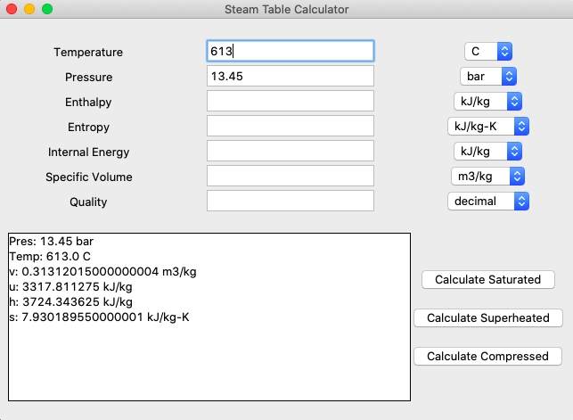

# Steam Table Calculator
### Calculates properties of water using compressed/saturated/superheated water tables from NIST.
#### Uses python3 \[pandas, numpy, tkinter\] to calculate values from tabulated values on excel sheets.
 
 ## Preface:
 Reading and interpolating steam tables can be difficult and time consuming. 
 I initially decided to create this calculator to make it quick and easy to access table values from my textbook.
 For a larger range of values, and to post on GitHub, I used the tables provided by the National Institute of 
 Standards and Technology.
 
 This is my first coding project since I began learning python. I wanted to utilize skills such as table manipulation 
 from Pandas, calculation methods from NumPy, and GUI interfacing using Tkinter that I had learned this summer. 
 
 I used Jupyter Notebook to create the backend calculations (all but unit conversions) and to test its functionality. 
 My major changes in approach to these backend calculations (prior to posting on GitHub) are shown in my Jupyter 
 Notebook file under the markdown 'Graveyard'.
 
 It should be noted that these are approximate calculations as interpolation of tables are such.
 The original tables do not include specific internal energy (u) so this was calculated using _u = h - pv_.
 Though the labels for inputs do not all specify mass-normalized values, they do except such values (specific \_\_\_ ).
 
 The original tabulation of the saturated, superheated, and compressed water values that I used are from the 
 National Institute of Standards and Technology. Please refer to http://www.nist.gov/srd/upload/NISTIR5078.htm
 (referred on 08/26/2020) for original data. For this project, I copied and edited them for easier use
 on excel.
 
 I am currently trying to find a way to make this easily accessible or a working website. 
 Any ideas would be greatly appreciated.
 
 To use this, one must download each of the following items:
 - Steam_Table_Converter_Backend.py
 - Steam_Table_Converter_App.py
 - steam tables.xlsx
 
 At the time of this update, I am using: Python 3.8.3, NumPy 1.18.5, Pandas 1.0.5, Tkinter 8.6.10 
 
 Examples of the GUI, inputs, and outputs, as well as expected inputs are also listed below.
 
 ## App Design and Functionality
 
 Enter input values in the entry boxes next to labels. There are drop-down menus for each input's units. This controls 
 the units of the inputs and corresponding outputs. After adding the proper inputs, the user clicks the respective 
 button for saturated, superheated, or compressed tables. Output values appear in the large list box. 
 
 *Interface of calculator*
 
 

 #### &nbsp;
 ### Saturated Examples
 Input options:
 - Either temperature or pressure
   - Nothing else
   - Any quality
   - Any other element (v/u/h/s)
 - No temperature or pressure
   - Requires one element (v/u/h/s) with a quality on the saturated liq/vap line (quality is 0 or 1)
 
 *Saturated example: from original table* 
 
 
 
  &nbsp;
 
 *Saturated example: changed output units*
  
 
 
  &nbsp;

 *Saturated example: vapor line*
  
 
 
  &nbsp;
 
 *Saturated example: inputted quality*

 
 
  &nbsp;
 
 *Saturated example: calculated quality*

 
 
 #### &nbsp;
 ### Superheated Examples
 Input options:
 - Must input a pressure with one additional element (v/u/h/s)
 
 *Superheated example: on table*
 
 
 
 &nbsp;
 
 *Superheated example: interpolated values*
 
 
 
 #### &nbsp;
 ### Compressed Examples
 Input options:
 - Must input a pressure with one additional element (v/u/h/s)
 
 *Compressed example: interpolated values*
 
 
 
 #### &nbsp;
 ### Error Message Examples
 - Error messages usually stem from improper inputs.
 
 *Error Example: too many inputs*
 
 
 
 &nbsp;
 
 *Error Example: out of range*
 
 
